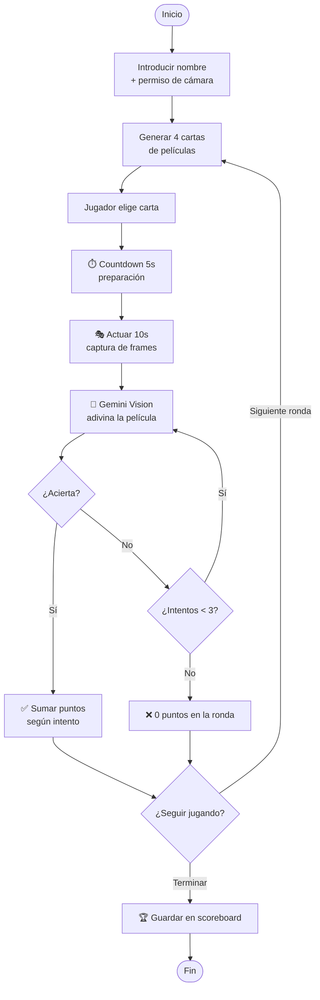

# PRD — Charades con IA (AI Charades)

> **Estado:** Draft · **Fecha:** 2026-06-02 · **Contexto:** Hackathon Cursor Madrid

---

## 1. Resumen ejecutivo

Aplicación web de **Charades (mímica) jugado en equipo con una IA**. El jugador actúa
(mímica) una película delante de la webcam y la IA, mediante un modelo de visión
(Gemini API), intenta adivinar el título lo antes posible. El objetivo común es
sumar la máxima puntuación posible; los mejores resultados aparecen en un
**scoreboard** público.

El componente de **Computer Vision** —requisito obligatorio del hackathon— se
cubre procesando el vídeo/frames de la actuación del jugador con la **Gemini API
(multimodal/vision)**.

---

## 2. Objetivo del hackathon

> El proyecto **debe** incluir un componente de visión por computador, ya sea un
> modelo local (p. ej. YOLOv5) o IA generativa multimodal (Gemini / Claude / GPT)
> que procese imágenes.

**Cómo lo cumplimos:** captura de webcam → muestreo de frames / clip de vídeo →
**Gemini Vision** interpreta la mímica y propone un título de película.

---

## 3. Problema y concepto

Charades es un juego social que normalmente requiere varias personas. Lo
reinventamos como una experiencia **single-player cooperativa**: tú actúas, la IA
adivina, y juntos intentáis batir el récord. Es divertido, demuestra capacidades
de visión en tiempo (casi) real y es fácil de demostrar en vivo.

**Categoría inicial:** Películas (arquitectura preparada para ampliar a animales,
objetos, etc. como _nice-to-have_).

---

## 4. Usuarios

- **Jugador casual:** entra, pone su nombre y juega una partida en < 2 minutos.
- **Espectador / jurado:** ve el scoreboard y entiende el juego en segundos.

No hay autenticación; identidad = nombre introducido al inicio.

---

## 5. Flujo de juego (core loop)

1. **Entrada:** el jugador abre la web, introduce su **nombre**. Se solicita
   permiso de cámara.
2. **Generación de cartas:** se muestran **4 cartas**, cada una con un título de
   película (seleccionados aleatoriamente de un pool/categoría).
3. **Elección:** el jugador elige la carta (película) que prefiera actuar.
4. **Cuenta atrás de preparación:** **5 segundos** para pensar la mímica
   (countdown visible en pantalla).
5. **Actuación:** **10 segundos** para hacer la mímica frente a la cámara. Durante
   este tiempo se capturan frames / se graba un clip.
6. **Adivinanza de la IA:** el clip/frames se envían a **Gemini** con un prompt de
   "estás jugando a Charades, adivina la película". La IA dispone de **hasta 3
   intentos**: propone un título; si falla, propone otro.
7. **Resolución de ronda:**
   - Acierto → puntos (más puntos cuantos menos intentos/menos tiempo).
   - 3 fallos → 0 puntos en esa ronda.
8. **Acumulación:** se suma al marcador de la partida. Se ofrece **siguiente
   ronda** o **terminar**.
9. **Fin de partida:** puntuación final → se guarda en el **scoreboard** si entra
   en el top.

```
Nombre → 4 cartas → elegir → ⏱5s pensar → 🎭10s actuar → 🤖 IA adivina (≤3 intentos)
        → puntuación → siguiente ronda / fin → scoreboard
```

### Diagrama del flujo



---

## 6. Mecánica de puntuación (propuesta)

| Resultado                         | Puntos |
| --------------------------------- | ------ |
| Acierto en el 1er intento         | 100    |
| Acierto en el 2º intento          | 60     |
| Acierto en el 3er intento         | 30     |
| 3 fallos                          | 0      |
| **Bonus** por adivinar rápido     | +1 por cada segundo restante del clip (opcional) |

> Valores a calibrar durante el playtesting. Mantener simple para el MVP.

---

## 7. Requisitos funcionales

- **RF1** — Pantalla de inicio con campo de nombre y solicitud de cámara.
- **RF2** — Generar 4 títulos aleatorios de película por ronda (sin repetir dentro
  de la partida).
- **RF3** — Selección de carta por el jugador.
- **RF4** — Countdown de 5 s (preparación) + 10 s (actuación) con feedback visual.
- **RF5** — Captura de vídeo/frames de la webcam durante los 10 s.
- **RF6** — Envío a Gemini Vision y obtención de hasta 3 intentos de adivinanza.
- **RF7** — Comparación de la adivinanza con el título objetivo (matching tolerante
  a mayúsculas/acentos/variantes).
- **RF8** — Cálculo y visualización de puntuación por ronda y total.
- **RF9** — Scoreboard persistente (top N) con nombre y puntuación.
- **RF10** — Continuar a la siguiente ronda o terminar la partida.

---

## 8. Requisitos no funcionales

- **Latencia:** la adivinanza de Gemini debe devolverse idealmente en < 3–4 s para
  no romper el ritmo del juego.
- **UX:** una sola pantalla fluida, feedback visual claro de cada fase.
- **Privacidad:** el vídeo se usa solo para la adivinanza; no se almacena de forma
  permanente (al menos en el MVP, dejarlo claro).
- **Demo-friendly:** debe funcionar de forma fiable en un portátil con webcam y
  buena luz.

---

## 9. Arquitectura técnica

```
┌─────────────────────────────┐        ┌──────────────────────────┐
│         Frontend (web)      │        │        Backend / API     │
│  - getUserMedia (webcam)    │        │  - /api/cards            │
│  - Captura frames / clip    │  HTTP  │  - /api/guess  ──────────┼──► Gemini API
│  - Countdowns + UI juego    │ ─────► │  - /api/score            │     (Vision)
│  - Scoreboard               │        │  - Scoreboard storage    │
└─────────────────────────────┘        └──────────────────────────┘
```

### Componente de visión (Gemini)

- Durante la actuación se **muestrean frames** (p. ej. 1 cada 0.5–1 s → ~10–20
  imágenes) **o** se graba un **clip corto** y se envía a Gemini multimodal.
- **Prompt** (a iterar): contexto "estás jugando a Charades con un humano que hace
  mímica; estas imágenes son su actuación en secuencia; adivina **el título de la
  película**. Responde solo con tu mejor candidato.". Para los 3 intentos se puede:
  - pedir el **top-3** de candidatos en una sola llamada, o
  - hacer llamadas iterativas (intento 1, si falla intento 2, …).
- Respuesta estructurada (JSON) para facilitar el matching.

### Matching título

- Normalizar (minúsculas, sin acentos, sin signos) y comparar; aceptar coincidencia
  exacta o por similitud alta (p. ej. incluye el título objetivo).

---

## 10. Stack propuesto

> Propuesta inicial — ajustable según preferencias del equipo.

- **Frontend:** Next.js + React + TypeScript (UI rápida, una sola pantalla).
- **Backend:** API routes de Next.js (full-stack en un solo repo).
- **Visión / IA:** Gemini API (modelo multimodal con soporte de imagen/vídeo).
- **Scoreboard:** almacenamiento ligero (JSON en disco / SQLite / Supabase). Para
  el MVP basta con persistencia simple en memoria o fichero.
- **Datos de películas:** lista curada local (p. ej. JSON con títulos populares).

---

## 11. Alcance

### MVP (imprescindible para la demo)

- Inicio con nombre + cámara.
- 4 cartas aleatorias de películas.
- Countdowns 5 s / 10 s.
- Captura y envío a Gemini, 1 adivinanza (luego ampliar a 3 intentos).
- Puntuación básica.
- Scoreboard (aunque sea en memoria/fichero).

### Nice-to-have (si sobra tiempo)

- 3 intentos iterativos de la IA con feedback en vivo.
- Más categorías (animales, objetos, canciones…).
- Bonus de puntuación por velocidad.
- Animaciones / sonidos.
- Scoreboard persistente y compartible.

### Versión avanzada — roles invertidos (futuro)

En la **v1** el humano actúa y la IA adivina (flujo descrito arriba). Una **versión
más avanzada**, si da tiempo, **invierte los roles**:

- La **IA actúa** usando IA generativa **text-to-image** o **text-to-video** para
  representar la película (genera la "mímica" visual).
- El **humano adivina** qué película es, siendo ahora la contraparte del equipo.

Sigue siendo cooperativo: el equipo (humano + IA) acumula puntos juntos. Esto
permite alternar roles entre rondas y enriquece la demo, pero queda **fuera del
MVP** por la complejidad y latencia de la generación visual.

---

## 12. Riesgos y mitigaciones

| Riesgo                                            | Mitigación                                         |
| ------------------------------------------------- | -------------------------------------------------- |
| Latencia de Gemini rompe el ritmo                 | Muestrear pocos frames; mostrar "pensando…" UI     |
| Gemini no adivina mímica abstracta                | Empezar con películas muy icónicas/conocidas       |
| Coste/límites de la API en demo                   | Caché, límite de rondas, claves de backup          |
| Permisos de cámara / compatibilidad navegador     | Probar en Chrome; instrucciones claras al usuario  |
| Mala iluminación en la sala del hackathon         | Pedir buena luz; probar en el sitio antes          |

---

## 13. Métricas de éxito (demo)

- Una partida completa funciona end-to-end sin fallos.
- Gemini acierta una proporción razonable de mímicas icónicas.
- El jurado entiende el juego y el componente de visión en < 1 minuto.

---

## 14. Preguntas abiertas

- ¿Categoría solo películas o multi-categoría? (MVP: solo películas)
- ¿3 intentos en una sola llamada (top-3) o iterativos?
- ¿Clip de vídeo completo o muestreo de frames hacia Gemini?
- ¿Scoreboard global persistente o por sesión?
- ¿Modo multijugador / por turnos como ampliación futura?
- Versión avanzada con roles invertidos: ¿text-to-image (más rápido/barato) o
  text-to-video (más espectacular pero más lento/caro) para que la IA actúe?
